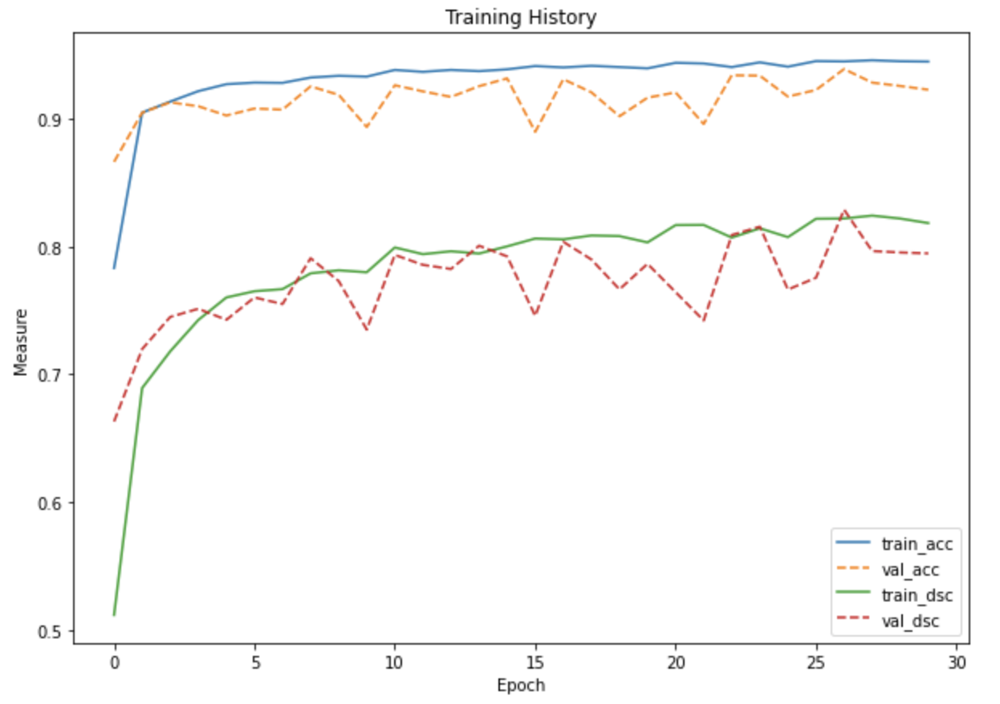
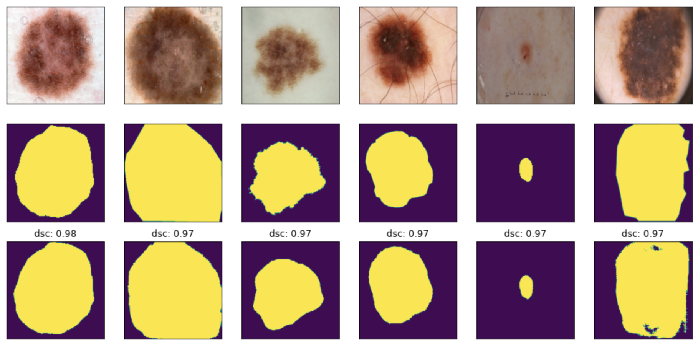
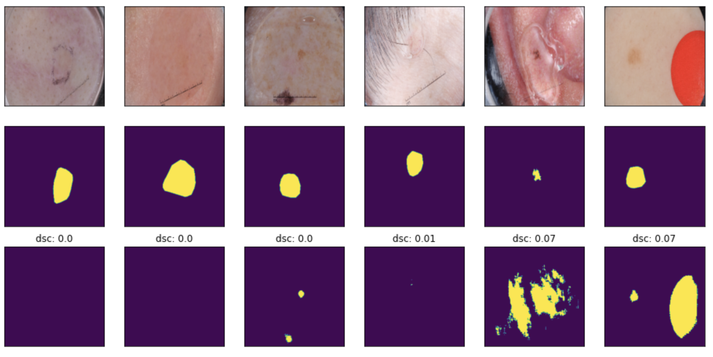
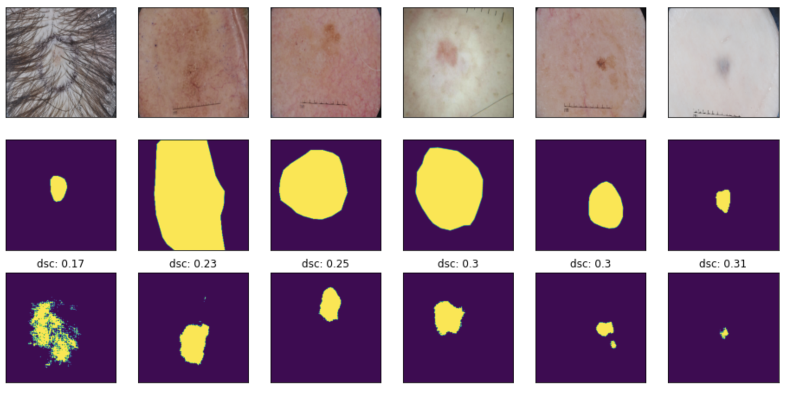

# Segmentation of ISICs data set using the Improved UNet [[1]](https://arxiv.org/abs/1802.10508v1)

This is the last assignment from Course COMP3710 Pattern Recognition in the University of Queensland in Semester 2, 2020.

## Problem --- Image Segmentation

ISICs stands for International Skin Imaging Collaboration, and the goal of this is to help participants develop image analysis tools to automatically diagnose melanoma from dermoscopic images. 
This project here, is to try to **segment** original skin **RGB images into monochrome images** which represents the possible area of skin lesions, in order to assist cutaneous melanoma diagnosis.

## Algorithm --- Improved UNet 

The improved UNet is developed by F. Isensee, P. Kickingereder, W. Wick, M. Bendszus, and K. H. Maier-Hein. [[1]](https://arxiv.org/abs/1802.10508v1) This deep learning net work is used to handle Brain Tumor Segmentation problem and deal with 3D images in the paper. But here I borrow this structure to cope with my **2D image segmentation problem**. 

### Improved UNet Structure

The figure above shows the structure of the improved UNet. 
- The *context module* is a pre-activation residual block, with two 3x3 convolutional layers and a dropout layer with p=0.3 in the middle. Noted that, the activation layer uses Leaky ReLU, and batch normalization is changed to instance normalization.
- The *upsampling module* is simply a upsampling2D layer followed by a 3x3 convolution that halves the number of feature map.
- The *localization module* contains a 3x3 convolution and then a 1x1 convolution which halves the number of feature maps.

### Python Code to Build the network
```python
def  context_module(inputs, filters):
""" filters is the output size of the module"""
	bn1 = tfa.layers.InstanceNormalization()(inputs)
	relu1 = LeakyReLU(alpha=0.01)(bn1)
	conv1 = Conv2D(filters, (3,3), padding='same')(relu1)
	dropout = Dropout(0.3)(conv1)
	bn2 = tfa.layers.InstanceNormalization()(dropout)
	relu2 = LeakyReLU(alpha=0.01)(bn2)
	conv2 = Conv2D(filters, (3,3), padding='same')(relu2)
	return conv2
	
def  upsampling_module(inputs, filters):
""" filters is the output size of the module"""
	up = UpSampling2D(size=(2,2))(inputs)
	conv = Conv2D(filters, (3,3), padding='same')(up)
	return conv
	
def  localization_module(inputs, filters):
""" filters is the output size of the module"""
	conv1 = Conv2D(filters*2, (3,3), padding='same')(inputs)
	conv2 = Conv2D(filters, (1,1))(conv1)
	return conv2
	
# Build the Model
def  improved_unet(h, w):
"""cm, um, lm stand for differnet modules"""
	inputs = Input((h,w,3))
	conv1 = Conv2D(16, (3,3), padding='same')(inputs)
	cm1 = context_module(conv1, 16)
	add1 = Add()([conv1, cm1]) # concat later
	conv2_stride = Conv2D(32, (3,3), strides=2, padding='same')(add1)
	cm2 = context_module(conv2_stride, 32)
	add2 = Add()([conv2_stride, cm2]) # concat later
	conv3_stride = Conv2D(64, (3,3), strides=2, padding='same')(add2)
	cm3 = context_module(conv3_stride, 64)
	add3 = Add()([conv3_stride, cm3]) # concat later
	conv4_stride = Conv2D(128, (3,3), strides=2, padding='same')(add3)
	cm4 = context_module(conv4_stride, 128)
	add4 = Add()([conv4_stride, cm4]) # concat later
	conv5_stride = Conv2D(256, (3,3), strides=2, padding='same')(add4)
	cm5 = context_module(conv5_stride, 256)
	add5 = Add()([conv5_stride, cm5])
	um1 = upsampling_module(add5, 128)
	concat1 = concatenate([um1, add4])
	lm1 = localization_module(concat1, 128)
	um2 = upsampling_module(lm1, 64)
	concat2 = concatenate([um2, add3])
	lm2 = localization_module(concat2, 64) # addup later
	um3 = upsampling_module(lm2, 32)
	concat3 = concatenate([um3, add2])
	lm3 = localization_module(concat3, 32) # addup later
	um4 = upsampling_module(lm3, 16)
	concat4 = concatenate([um4, add1])
	conv6 = Conv2D(32, (3,3), padding='same')(concat4) # addup later
	seg1 = Conv2D(1, (1,1), padding='same')(lm2)
	seg1 = UpSampling2D(size=(2,2))(seg1)
	seg2 = Conv2D(1, (1,1), padding='same')(lm3)
	sum1 = Add()([seg1, seg2])
	sum1 = UpSampling2D(size=(2,2))(sum1)
	seg3 = Conv2D(1, (1,1), padding='same')(conv6)
	sum2 = Add()([sum1, seg3])
	outputs = Activation('sigmoid')(sum2)
	network = tf.keras.Model(inputs = [inputs], outputs = [outputs])
	return network
```

## Data

The given data located in two different folders, one contains the input images (original skin RGB images), the other contains the output images (segment images). There are **2594 images in total**.

### Train, Validation, Test Sets
I sort these images by their names, shuffle them using a random seed, and take the first 1600 images as training data, the next 500 as validation data and the remains as testing data.

### Image Resize
Noted that images from the given data are not in the same shape. So I use tensorflow built in function to resize these images to **(256, 256)**.

## Result

### Dice Similarity Coefficient

We use DSC to measure the performance of the predicted segments. 

### Trainnig Process and Average DSC

This plot shows how metrics changes during the training process. 
After 30 epochs of training, the predictions on test set reaches an average dice similarity of **83.9%**. To be more specific, we can look into some prediction segments. 

### Good Predictions



### Bad Predictions




### Discussion
In the above figures, the first row is the input, the second row is the ground truth segment (actually I don't know if it's really the ground truth or just some output given by the lecturer's segmentation network), and the third row is the segment given by this model. We can have some conclusions based on these figures.
- The model can give good segmentation if the input image is clear and have same style as in the examples.
- Too much hair will affect the performance of segmentation.
- The model is hard to notice the skin lesion if the color looks similar to the healthy skin.


## Reference
- [1] F. Isensee, P. Kickingereder, W. Wick, M. Bendszus, and K. H. Maier-Hein, “Brain Tumor Segmentation and Radiomics Survival Prediction: Contribution to the BRATS 2017 Challenge,” Feb. 2018. [Online]. Available: [https://arxiv.org/abs/1802.10508v1](https://arxiv.org/abs/1802.10508v1)